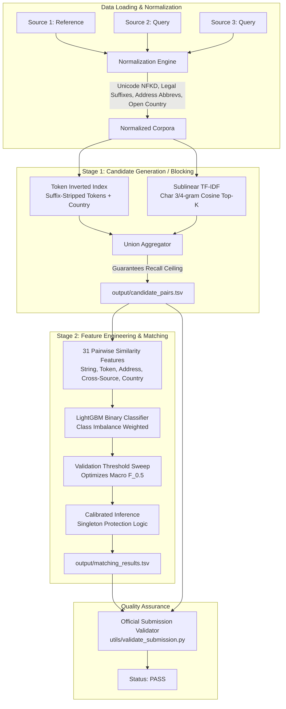

# Business Entity Resolution Pipeline

[](LICENSE)
[](https://www.python.org/downloads/)
[]()
[]()

A high-precision, two-stage **Business Entity Resolution (ER)** pipeline for matching noisy business entity records across disparate data sources.

Developed for the **Amazon ML Challenge**, this solution addresses cross-source entity matching across 3 noisy sources where Source 1 serves as the deduplicated reference truth, and Sources 2 & 3 contain noisy, un-deduplicated query records.

---

## 📌 Architecture Overview

The system is architected around two decoupled stages: **Recall-Maximizing Hybrid Blocking** followed by **Precision-Tuned Gradient Boosted Trees (LightGBM)** optimized specifically for macro-averaged $F_{0.5}$.



---

## 🚀 Key Technical Highlights

1. **Hybrid Union Blocking**:
   - Pruning over $N_1 \times (N_2 + N_3)$ pairs with $>99\%$ reduction ratio.
   - Combines exact-token inverted indexing with character 3-gram/4-gram cosine top-$K$ retrieval to ensure zero recall degradation from typos or transliterations.
2. **Precision-Biased $F_{0.5}$ Metric Alignment**:
   - Macro-averaged across all Source 1 entities:
     $$F_{0.5} = \frac{1.25 \times \text{Precision} \times \text{Recall}}{0.25 \times \text{Precision} + \text{Recall}}$$
   - Precision is weighted $2\times$ over recall to penalize false merges.
   - **Singleton-Aware**: Correctly identifies entities with 0 matches (worth a full 1.0 points).
3. **Open-Set Generalization (Unseen Countries)**:
   - Generalizes seamlessly to unseen country labels (e.g., France in test data) without hardcoding or categorical filtering.
   - Native support for multilingual legal suffixes (*SARL, SAS, SA, Société, Cie*) and street components (*Rue, Boulevard, Allee, Chemin*).
4. **Strict Fair Play & License Compliance**:
   - **Zero external APIs or databases**: No geocoding, external registries, or web scraping.
   - **Open-source model**: Built on LightGBM (MIT License), $<200$ trees (~5 MB), strictly complying with the $\le 8\text{B}$ parameter limit.

---

## 📂 Project Structure

```
.
├── code/
│   └── business_entity_resolution/
│       ├── src/
│       │   ├── __init__.py
│       │   ├── normalization.py       # Multi-jurisdiction text normalizers & dictionaries
│       │   ├── blocking.py            # Union candidate generation (token + TF-IDF n-gram)
│       │   ├── features.py            # 31 pairwise similarity features
│       │   ├── matching.py            # LightGBM training & probability calibration
│       │   ├── scoring.py             # Exact F_0.5 calculation & threshold grid sweep
│       │   ├── inference.py           # Output generator & rule validator
│       │   ├── pipeline.py            # CLI entry point (train / test / both)
│       │   └── test_components.py     # Unit test suite
│       ├── models/                    # Saved model artifacts & calibrated threshold
│       ├── README.md                  # Module-level documentation
│       └── requirements.txt           # Pinned dependencies
├── dataset/
│   ├── train/                         # Training sources (S1, S2, S3 + ground truth)
│   └── test/                          # Test sources (S1, S2, S3)
├── output/
│   ├── matching_results.tsv           # Final matches for submission
│   └── candidate_pairs.tsv            # Candidate blocking set
├── utils/
│   └── validate_submission.py         # Standalone stdlib submission validator
├── .github/workflows/
│   └── ci.yml                         # Automated multi-platform CI
├── create_synthetic_data.py           # Synthetic benchmark dataset generator
├── Documentation_template.md          # Official methodology write-up
├── requirements.txt                   # Root environment dependencies
├── LICENSE                            # MIT License
└── README.md                          # Root repository documentation
```

---

## 🛠️ Quickstart

### ⚡ One-Click Execution (All Prerequisites + Pipeline)

You can run everything—dependency checks, unit tests, dataset verification, training, inference, and submission validation—in a single command:

```bash
python run_all.py
```
*(On Windows PowerShell, you can also run `.\run.ps1`; on Command Prompt: `run.bat`; on Linux/macOS: `./run.sh`)*

---

### Step-by-Step Execution

#### 1. Environment Setup

Clone the repository and install dependencies:

```bash
git clone https://github.com/<your-username>/amazon-ml-entity-resolution.git
cd amazon-ml-entity-resolution

# Create and activate virtual environment (optional)
python -m venv venv
source venv/bin/activate  # On Windows: venv\Scripts\activate

# Install dependencies
pip install -r requirements.txt
```

### 2. Verify Installation with Unit Tests

Run the built-in test suite:

```bash
python code/business_entity_resolution/src/test_components.py
```

### 3. Running with Sample / Synthetic Data

Generate a realistic test environment with US, India, and France records:

```bash
python create_synthetic_data.py
```

Execute the end-to-end pipeline:

```bash
# Train on training split, tune threshold, and infer on test data
python -m code.business_entity_resolution.src.pipeline --mode both
```

### 4. Running with Actual Competition Data

Place the official competition files into their respective directories:

```
dataset/
├── train/
│   ├── train_source1.tsv
│   ├── train_source2.tsv
│   ├── train_source3.tsv
│   └── train_ground_truth.tsv
└── test/
    ├── test_source1.tsv
    ├── test_source2.tsv
    └── test_source3.tsv
```

Then execute:

```bash
# 1. Model training & validation reporting
python -m code.business_entity_resolution.src.pipeline --mode train --val-fraction 0.2

# 2. Retrain on full data & generate test outputs
python -m code.business_entity_resolution.src.pipeline --mode both

# 3. Validate output compliance
python utils/validate_submission.py --matching output/matching_results.tsv --candidate output/candidate_pairs.tsv --test-dir dataset/test
```

---

## 🧪 Submission Validation Rules

The generated output files adhere strictly to the challenge format:

- **`output/matching_results.tsv`**:
  - Tab-separated (`sep="\t"`), columns `source1_entity_id\tmatched_entity_ids`.
  - Exactly one row per test Source 1 entity; empty string for singletons.
  - Comma-separated IDs, no quoting, no duplicates, no self-matches.
- **`output/candidate_pairs.tsv`**:
  - Tab-separated (`sep="\t"`), columns `source1_entity_id\tcandidate_entity_ids`.
  - Every ID in `matching_results.tsv` is guaranteed to be a subset of `candidate_pairs.tsv`.

Validate locally anytime using:

```bash
python utils/validate_submission.py \
    --matching output/matching_results.tsv \
    --candidate output/candidate_pairs.tsv \
    --test-dir dataset/test
```

---

## 📦 Packaging for Final Submission

To package the project into the requested competition zip archive:

```bash
# On Linux / macOS:
zip -r submission.zip output/ code/ Documentation_template.md

# On Windows PowerShell:
Compress-Archive -Path output, code, Documentation_template.md -DestinationPath submission.zip
```

---

## 📄 License

This project is licensed under the [MIT License](LICENSE).
